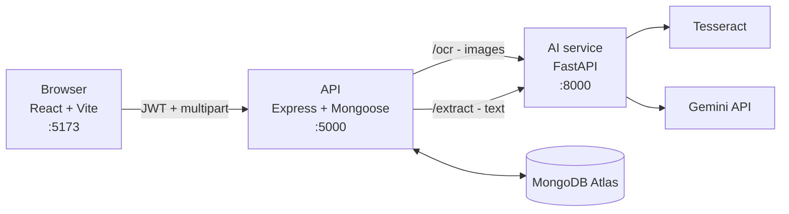

# Argus

**Cyber fraud evidence, organised.**

Victims of online fraud end up with evidence scattered across places that do not talk to
each other — a WhatsApp thread, a handful of screenshots, a bank statement. Filing a
complaint means reconstructing what happened, in order, with the account numbers and UPI
IDs written out correctly.

Argus takes those files, reads them, pulls out the entities that matter, scores the case,
and files it all under one case ID.

---

## What it does

Upload a piece of evidence and Argus will:

1. **Read it** — Tesseract OCR for screenshots, direct text for chat exports.
2. **Extract entities** — phone numbers, UPI IDs, bank accounts, amounts, dates, names,
   and urgency language, via the Gemini API.
3. **Score it** — a rule-based fraud risk score for the case, recomputed every time
   evidence is added.
4. **File it** — stored against a case ID, so evidence added over time accumulates into
   one case rather than a folder of loose files.
5. **Flag what is missing** — the evidence type the case still needs, given what its
   entities imply.
6. **Show it back** — a dashboard with the risk score, the gaps, a timeline, and the
   extracted entities as tags.

### Supported evidence

| Type | Format | How it is read |
|---|---|---|
| WhatsApp export | `.txt` from *Export chat* | Read directly as text |
| Screenshot | PNG / JPG | Tesseract OCR |
| Bank statement | `.txt` / `.csv`, or a screenshot | Text directly, or OCR |

Three types, deliberately. The prototype does not claim to handle anything else.

### Accounts and roles

| Role | Can do |
|---|---|
| `user` | Create cases, upload evidence, read **only their own** cases |
| `investigator` | Read **every** case. Cannot upload or modify anything |

A case belongs to the account that created it. A case you do not own answers `404` — the
same as a case that does not exist — so case IDs cannot be probed to discover whose they
are.

**Signup always creates a `user`.** An investigator reads every case in the system, so the
role is granted rather than claimed — a `role` in the signup body is ignored. There is no
admin surface to grant one from, so it is a database edit:

```js
// mongosh, against the Argus database
db.users.updateOne({ email: 'reviewer@example.com' }, { $set: { role: 'investigator' } })
```

The role is signed into the token, so it applies from that account's next sign-in.

---

## Status

A working prototype, not a finished product. Being specific about the line:

**Built and working**
- Email/password accounts, JWT sessions, the two roles above
- Upload screen — drag-and-drop, click-to-browse, or paste text
- OCR and entity extraction pipeline
- Rule-based case risk scoring, recomputed on every upload
- Missing-evidence detection — three rules, surfaced on the dashboard in gap violet
- Case list and case dashboard — evidence cards, entity tags, timeline, raw text
- Landing page, light and dark themes

**Designed but not built**
- Relationship graph across entities.
- Generated complaint report. The landing page mock shows *File on cybercrime.gov.in* and
  *Export PDF*; neither exists.
- Storing the uploaded file itself. Screenshots are OCR'd in memory and discarded — only
  the extracted text is kept.
- Automated tests.

---

## Architecture

Three services. The browser only ever talks to the API; the API calls the AI service
internally.



**Why the split?** OCR and model calls are Python's territory — Tesseract bindings and the
Gemini SDK both live there. Keeping them behind their own service means the API layer
stays a thin CRUD and access-control boundary, and the slow, failure-prone work is
isolated in one place.

**Why Gemini rather than OpenAI?** A usable free tier. The quota is small and per model
per day; the model is pinned in `ai-service/entity_extraction.py` and must never be a
`-latest` alias, which can silently move to a model with a much smaller allowance.

---

## Risk scoring

Rule-based, in one file: `backend/lib/riskScore.js`. No model involved. Every number is a
judgement call rather than a measurement, and keeping them explicit means a score can be
explained to the person it is about.

**Per piece of evidence**

| Signal | Points |
|---|---|
| Each suspicious keyword (`URGENT`, `OTP`, `blocked`, …) | +15 |
| An amount over ₹10,000 | +20 |
| An amount over ₹50,000 | +25 |
| A phone number **and** a UPI ID together | +15 |

The two amount tiers are **cumulative** — ₹75,000 clears both and scores 45 — so a larger
sum always outranks a smaller one.

**Per case**

```
case score = highest single evidence score
           + 10 per additional piece of evidence
           capped at 100
```

The base is the *highest* document score, not the sum. Summing would double-count
corroboration: two ordinary documents at 60 each would total 120, cap at 100, and make
every multi-evidence case "High risk" — which would render the corroboration bonus
meaningless.

**Bands**

| Score | Label | Colour |
|---|---|---|
| 0–30 | Low risk | blue |
| 31–65 | Medium risk | caution orange |
| 66–100 | High risk | alert red |

Red is reserved for the top band only — see [Design notes](#design-notes). Low is blue
rather than green: a low score also looks exactly like an extraction that found nothing,
and green would promise a safety the score cannot establish.

---

## Missing evidence

Rule-based as well, in `backend/lib/gaps.js`. Every rule has the same shape: an entity
turned up somewhere on the case, and the evidence type that would corroborate it was never
uploaded.

| Found in the evidence | Missing | What it means |
|---|---|---|
| Amounts | Bank statement | Money is named, nothing shows it moving |
| UPI IDs | Screenshot | A payment handle with no picture of the transfer |
| Phone numbers | WhatsApp export | A contact number with no conversation behind it |

Three rules, one per supported evidence type. That is a scope rule rather than a
coincidence: a gap can only name something Argus can actually accept, or it would be
telling a victim to find a file the upload screen would then refuse.

Derived on every read rather than stored — unlike the score there is no number that needs
to stay stable between uploads. They are drawn in gap violet, never red: "you have not
uploaded a bank statement" is an absence, not a confirmed fraud signal.

**They inherit every miss the extraction made.** An amount the model did not pick up is an
amount that cannot be flagged as unsupported, so a case with no gaps is not a case with
nothing missing.

---

## Getting started

### Prerequisites

- Node.js 20+
- Python 3.11+
- [Tesseract OCR](https://github.com/tesseract-ocr/tesseract) on your `PATH`
- A MongoDB connection string (Atlas free tier is fine)
- A [Gemini API key](https://aistudio.google.com/apikey)

### Configuration

Two `.env` files, neither tracked:

```ini
# backend/.env
MONGO_URI=mongodb+srv://...
PORT=5000
AI_SERVICE_URL=http://localhost:8000
JWT_SECRET=<a long random string>
```

```ini
# ai-service/.env
GEMINI_API_KEY=...
```

Generate a secret with:

```bash
node -e "console.log(require('crypto').randomBytes(48).toString('base64url'))"
```

The API refuses to start without `JWT_SECRET`. That is deliberate — a hardcoded fallback
would be worse than no auth at all, because every deployment would share a secret anyone
reading the source could forge tokens with.

### Install

```bash
# AI service
cd ai-service
python -m venv venv
./venv/Scripts/activate          # macOS/Linux: source venv/bin/activate
pip install -r requirements.txt

# API
cd ../backend && npm install

# Frontend
cd ../frontend && npm install
```

### Run

Three terminals. **Start them in this order** — the API calls the AI service on every
upload, so it needs it up first.

```bash
# 1. AI service  ->  :8000
cd ai-service && ./venv/Scripts/python.exe -m uvicorn main:app --reload

# 2. API  ->  :5000
cd backend && node server.js

# 3. Frontend  ->  :5173
cd frontend && npm run dev
```

Open <http://localhost:5173>, create an account, and upload something.

> The frontend calls `/api/*` and Vite proxies it to `:5000`. This keeps the request
> same-origin, which is why the API needs no CORS layer. If you serve the frontend any
> other way, add one.

---

## API

All `/api/evidence` and `/api/cases` routes require `Authorization: Bearer <token>`.

### Auth

| Endpoint | Body | Returns |
|---|---|---|
| `POST /api/auth/signup` | `{ email, password }` | `201` → `{ token, user }`, always a `user` |
| `POST /api/auth/login` | `{ email, password }` | `200` → `{ token, user }` |
| `GET /api/auth/me` | — | `{ user }`, or `401` if the token is stale |

Passwords are bcrypt hashed and at least 8 characters. Login returns the same message for
an unknown email and a wrong password, so the endpoint cannot be used to discover which
addresses are registered.

```bash
curl -X POST http://localhost:5000/api/auth/signup \
  -H 'Content-Type: application/json' \
  -d '{"email":"victim@example.com","password":"password123"}'
```

### `GET /api/cases`

Cases the caller may see — their own, or all of them for an investigator — newest first.
Investigators additionally get `ownerEmail` on each row.

```json
{
  "cases": [
    { "caseId": "CASE-2026-0412", "riskScore": 100, "riskLabel": "High risk",
      "evidenceCount": 1, "updatedAt": "2026-08-05T09:12:03.114Z" }
  ]
}
```

### `POST /api/evidence/upload`

`multipart/form-data`. Send **either** `file` or `text`, not both. Requires the `user`
role.

| Field | Required | Notes |
|---|---|---|
| `caseId` | yes | Any string. The UI generates `CASE-<year>-<4 digits>` |
| `type` | yes | `whatsapp` \| `screenshot` \| `bank_statement` |
| `file` | either | Image for the OCR path |
| `text` | either | Raw text, skips OCR |

Returns `201` with the stored evidence document, and rescores the case. Uploading to a
case ID owned by another account returns `403`, checked *before* any OCR or model call so
it costs no quota.

```bash
curl -X POST http://localhost:5000/api/evidence/upload \
  -H "Authorization: Bearer $TOKEN" \
  -F "caseId=CASE-2026-0001" \
  -F "type=whatsapp" \
  -F "text=URGENT: account blocked. Send Rs 75,000 to scam@okicici. Call +91 98888 77777, share OTP."
```

### `GET /api/evidence/:caseId`

The whole case. Returns `404` if the case does not exist **or** is not yours.

```json
{
  "caseId": "CASE-2026-0001",
  "riskScore": 100,
  "riskLabel": "High risk",
  "evidenceCount": 1,
  "gaps": [
    {
      "missingType": "bank_statement",
      "title": "No bank statement",
      "detail": "Money is named in the evidence, but no bank statement has been uploaded to show it leaving an account.",
      "values": ["Rs 75,000"]
    },
    {
      "missingType": "screenshot",
      "title": "No screenshot of the payment",
      "detail": "A payment handle turned up in the text, but no screenshot has been uploaded to show a transfer to it.",
      "values": ["scam@okicici"]
    }
  ],
  "evidence": [
    {
      "_id": "...",
      "type": "whatsapp",
      "rawText": "URGENT: account blocked. Send Rs 75,000 to ...",
      "extractedEntities": {
        "names": [],
        "phone_numbers": ["+91 98888 77777"],
        "upi_ids": ["scam@okicici"],
        "bank_accounts": [],
        "amounts": ["Rs 75,000"],
        "dates": [],
        "suspicious_keywords": ["URGENT", "account blocked", "OTP"]
      },
      "uploadedAt": "2026-08-05T09:12:03.114Z"
    }
  ]
}
```

### Internal — AI service

Not exposed to the browser.

| Endpoint | Purpose |
|---|---|
| `POST /ocr` | Image bytes → text |
| `POST /extract` | Text or image → the entity object above |
| `GET /health` | Liveness |

---

## Project structure

```
argus/
├── frontend/                     React + Vite
│   └── src/
│       ├── pages/                Home, Login, StartCase, CasesList, CaseDashboard
│       ├── components/           AuthProvider, RequireAuth, hero, sections, nav
│       ├── lib/                  api client, auth context, case IDs, risk bands
│       └── styles/               tokens, typography, shared components
├── backend/                      Express + Mongoose
│   ├── lib/riskScore.js          scoring rules — the file to adjust
│   ├── lib/gaps.js               missing-evidence rules
│   ├── lib/entities.js           reading the model's entity object safely
│   ├── middleware/auth.js        JWT signing, requireAuth, requireRole
│   ├── models/                   User, Case, Evidence
│   └── routes/                   auth, cases, evidence
├── ai-service/                   FastAPI
│   ├── main.py                   routes
│   ├── ocr.py                    Tesseract
│   ├── entity_extraction.py      Gemini call + error translation
│   └── prompts.py                the extraction prompt
└── docs/
```

---

## Design notes

The interface is built on a locked token set in `frontend/src/styles/tokens.css`. Two
rules are load-bearing rather than decorative:

**Red is reserved.** `--alert-*` means a confirmed fraud signal and nothing else. Form
validation and failed requests use caution orange, missing evidence uses violet, and a
risk score only earns red in the top band. If red appears everywhere, it stops meaning
anything in the one place it matters.

**Numbers are set in monospace with `tabular-nums`.** Account numbers, UPI IDs and phone
numbers are the evidence. A `0` misread as `O` in a complaint is a real failure, not a
cosmetic one.

---

## Data policy

**Synthetic and sample data only** — in code, tests, demos, and UI copy. Every phone
number, UPI ID and amount in this repository is invented. This is a prototype and has no
business holding a real victim's evidence.
