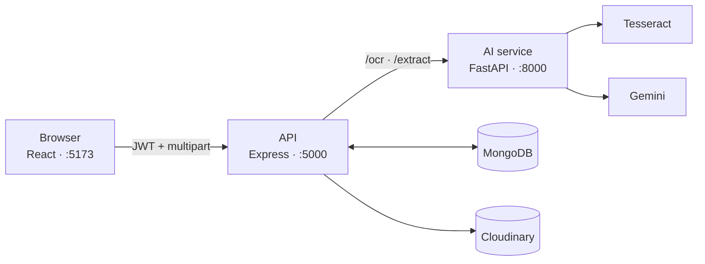

# Argus

**Cyber fraud evidence, organised.**

Victims of online fraud end up with evidence scattered across a WhatsApp thread, a handful
of screenshots and a bank statement. Argus reads those files, pulls out the entities that
matter, and turns them into one case file you can take to a complaint.

## Live

| | |
|---|---|
| **App** | <https://theargus.vercel.app> |
| **API** | <https://argus-backend-rgm6.onrender.com> |
| **AI service** | <https://argus-ai-service.onrender.com> |

Free hosting — the first request after an idle spell takes a minute while the services wake.

---

## What it does

Upload a piece of evidence, and Argus will:

- **Read it** — Tesseract OCR for screenshots, the text layer for PDFs, direct text for chat exports
- **Extract entities** — names, phone numbers, UPI IDs, bank accounts, amounts, dates and urgency language, via Gemini
- **Score it** — a rule-based fraud risk score out of 100, recomputed on every upload
  (0–30 low, 31–65 medium, 66–100 high)
- **Flag what is missing** — the evidence type the case still needs, given what it found
- **Map it** — a graph of which entities turn up together across evidence
- **Report it** — the whole case as a downloadable PDF
- **Track it** — *building* → *ready to file* → *filed* → *resolved*, set by the case's owner

Evidence accumulates under one case ID, and the original files are kept, not just the text
read out of them.

### Supported evidence

| Type | Format |
|---|---|
| WhatsApp export | `.txt` from *Export chat* |
| Screenshot | PNG / JPG |
| Bank statement | `.pdf`, `.csv`, `.txt`, or a screenshot |

Three types, deliberately. The prototype does not claim to handle anything else.

### Accounts

Two roles. A **user** owns the cases they create; an **investigator** can read every case
but upload nothing. A case you do not own is indistinguishable from one that does not exist.

Signup creates a user unless it carries the **investigator invite code** — a secret set as
`INVESTIGATOR_INVITE_CODE` and given out privately. Anything else, including a wrong code,
a blank field, or a `role` in the request body, produces an ordinary user account. A wrong
code raises no error: a form that says "that code is wrong" is a free oracle for guessing
at it.

With no code configured, nothing can self-register as an investigator. Either way the role
can also be granted directly, which is the fallback if the code leaks or nobody set one:

```js
// mongosh, against the Argus database
db.users.updateOne({ email: 'reviewer@example.com' }, { $set: { role: 'investigator' } })
```

The role is signed into the token, so a promoted account has to sign in again for it to
apply.

---

## Stack

React + Vite · Node + Express + Mongoose · Python + FastAPI · MongoDB Atlas · Cloudinary ·
Gemini · Tesseract

The browser only ever talks to the API; the API calls the AI service internally. OCR and
model calls live in Python because that is where Tesseract and the Gemini SDK are, which
keeps the slow, failure-prone work in one place.



---

## Running locally

The links above are for using Argus. This is for running or changing it.

Needs Node 20.19+, Python 3.11+, Tesseract on your `PATH`, a MongoDB connection string and a
[Gemini API key](https://aistudio.google.com/apikey).

```ini
# backend/.env
MONGO_URI=mongodb+srv://...
JWT_SECRET=<a long random string>
AI_SERVICE_URL=http://localhost:8000
CORS_ORIGINS=http://localhost:5173
CLOUDINARY_URL=cloudinary://<key>:<secret>@<cloud-name>
INVESTIGATOR_INVITE_CODE=<a secret you share only with investigators>
```

`INVESTIGATOR_INVITE_CODE` is optional. Leave it out and signup can only ever create
victim accounts — see [Accounts](#accounts).

```ini
# ai-service/.env
GEMINI_API_KEY=...
```

`CLOUDINARY_URL` is optional; without it, original uploads are not kept.

Start the AI service first — the API calls it on every upload.

```bash
# :8000
cd ai-service && python -m venv venv && ./venv/Scripts/activate
pip install -r requirements.txt && python -m uvicorn main:app --reload

# :5000
cd backend && npm install && node server.js

# :5173
cd frontend && npm install && npm run dev
```

On macOS or Linux the activate step is `source venv/bin/activate`. Then open
<http://localhost:5173>.

---

## API

Everything except signup and login needs `Authorization: Bearer <token>`.

| Endpoint | Purpose |
|---|---|
| `POST /api/auth/signup` · `/login` · `GET /api/auth/me` | Accounts and sessions |
| `GET /api/cases` | Cases the caller may see |
| `PATCH /api/cases/:caseId/status` | Move a case along — owner only |
| `POST /api/cases/:caseId/report` | The case as a PDF |
| `POST /api/evidence/upload` | Add evidence — multipart, `file` or `text` |
| `GET /api/evidence/:caseId` | The case: score, gaps, graph and evidence |

---

## Known limitations

- No email verification — any address works at signup.
- Scanned PDFs are not read; only a PDF's existing text layer is used.
- Investigator access is a single shared invite code, not per-person invitations — if it
  leaks, it has to be rotated for everyone.
- Free-tier hosting sleeps, so the first request after idle is slow.
- Only the scoring and gap rules are tested (`cd backend && npm test`); nothing else is.

---

## Data policy

**Synthetic and sample data only** — in code, tests, demos and UI copy. Every phone number,
UPI ID and amount in this repository is invented. This is a prototype and has no business
holding a real victim's evidence.
