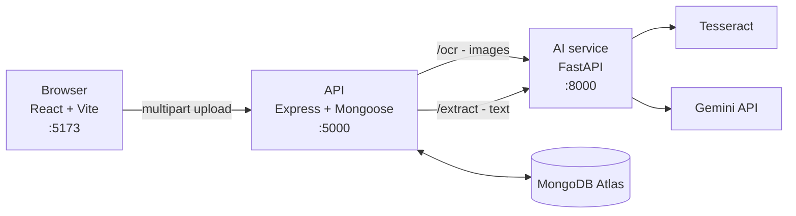

# Argus

**Cyber fraud evidence, organised.**

Victims of online fraud end up with evidence scattered across places that do not talk to
each other — a WhatsApp thread, a handful of screenshots, a bank statement. Filing a
complaint means reconstructing what happened, in order, with the account numbers and UPI
IDs written out correctly.

Argus takes those files, reads them, pulls out the entities that matter, and files them
under one case ID.

---

## What it does

Upload a piece of evidence and Argus will:

1. **Read it** — Tesseract OCR for screenshots, direct text for chat exports.
2. **Extract entities** — phone numbers, UPI IDs, bank accounts, amounts, dates, names,
   and urgency language, via the Gemini API.
3. **File it** — stored against a case ID, so evidence added over time accumulates into
   one case rather than a folder of loose files.
4. **Show it back** — a dashboard with a timeline and the extracted entities as tags.

### Supported evidence

| Type | Format | How it is read |
|---|---|---|
| WhatsApp export | `.txt` from *Export chat* | Read directly as text |
| Screenshot | PNG / JPG | Tesseract OCR |
| Bank statement | `.txt` / `.csv`, or a screenshot | Text directly, or OCR |

Three types, deliberately. The prototype does not claim to handle anything else.

---

## Status

This is a working prototype, not a finished product. Being specific about the line:

**Built and working**
- Upload screen — drag-and-drop, click-to-browse, or paste text
- OCR and entity extraction pipeline
- Persistence to MongoDB, keyed by case ID
- Case dashboard — evidence cards, extracted entity tags, upload timeline, raw text
- Landing page, light and dark themes

**Designed but not built**
- Fraud risk scoring. The landing page shows a *mock* of a scored case; nothing in the
  backend computes a score yet, so the real dashboard does not display one. Inventing a
  number would make the screen assert something the system does not know.
- Missing-evidence detection — flagging gaps rather than only processing what was given.
- Relationship graph across entities.
- Generated complaint report.

---

## Architecture

Three services. The backend is the only one the browser talks to; it calls the AI service
internally.



**Why the split?** OCR and model calls are Python's territory — Tesseract bindings and the
Gemini SDK both live there. Keeping them behind their own service means the API layer stays
a thin CRUD boundary and the slow, failure-prone work is isolated in one place.

**Why Gemini rather than OpenAI?** A usable free tier. See [Limitations](#limitations).

---

## Getting started

### Prerequisites

- Node.js 20+
- Python 3.11+
- [Tesseract OCR](https://github.com/tesseract-ocr/tesseract) on your `PATH`
- A MongoDB connection string (Atlas free tier is fine)
- A [Gemini API key](https://aistudio.google.com/apikey)

### Configuration

Two `.env` files, neither tracked:

```ini
# backend/.env
MONGO_URI=mongodb+srv://...
PORT=5000
AI_SERVICE_URL=http://localhost:8000
```

```ini
# ai-service/.env
GEMINI_API_KEY=...
```

### Install

```bash
# AI service
cd ai-service
python -m venv venv
./venv/Scripts/activate          # macOS/Linux: source venv/bin/activate
pip install -r requirements.txt

# API
cd ../backend && npm install

# Frontend
cd ../frontend && npm install
```

### Run

Three terminals. **Start them in this order** — the API calls the AI service on every
upload, so it needs it up first.

```bash
# 1. AI service  ->  :8000
cd ai-service && ./venv/Scripts/python.exe -m uvicorn main:app --reload

# 2. API  ->  :5000
cd backend && node server.js

# 3. Frontend  ->  :5173
cd frontend && npm run dev
```

Open <http://localhost:5173>.

> The frontend calls `/api/*` and Vite proxies it to `:5000`. This keeps the request
> same-origin, which is why the API needs no CORS layer. If you serve the frontend any
> other way, add one.

---

## API

### `POST /api/evidence/upload`

`multipart/form-data`. Send **either** `file` or `text`, not both.

| Field | Required | Notes |
|---|---|---|
| `caseId` | yes | Any string. The UI generates `CASE-<year>-<4 digits>` |
| `type` | yes | `whatsapp` \| `screenshot` \| `bank_statement` |
| `file` | either | Image for the OCR path |
| `text` | either | Raw text, skips OCR |

Returns `201` with the stored document.

```bash
curl -X POST http://localhost:5000/api/evidence/upload \
  -F "caseId=CASE-2026-0001" \
  -F "type=whatsapp" \
  -F "text=Rahul sent Rs 25,000 to rahul.s@okhdfc on 12 Aug. URGENT: share the OTP now."
```

```json
{
  "_id": "...",
  "caseId": "CASE-2026-0001",
  "type": "whatsapp",
  "rawText": "Rahul sent Rs 25,000 to ...",
  "extractedEntities": {
    "names": ["Rahul"],
    "phone_numbers": [],
    "upi_ids": ["rahul.s@okhdfc"],
    "bank_accounts": [],
    "amounts": ["Rs 25,000"],
    "dates": ["12 Aug"],
    "suspicious_keywords": ["URGENT", "OTP"]
  },
  "uploadedAt": "2026-08-04T18:01:10.991Z"
}
```

### `GET /api/evidence/:caseId`

Every piece of evidence on a case, oldest first. An unknown case returns `[]`, not a 404.

### Internal — AI service

| Endpoint | Purpose |
|---|---|
| `POST /ocr` | Image bytes → text |
| `POST /extract` | Text or image → the entity object above |
| `GET /health` | Liveness |

---

## Project structure

```
argus/
├── frontend/               React + Vite
│   └── src/
│       ├── pages/          Home, StartCase (/start), CaseDashboard (/case/:caseId)
│       ├── components/     Hero, sections, nav, theme toggle
│       ├── lib/            API client, case IDs, risk thresholds
│       └── styles/         Design tokens, typography, shared components
├── backend/                Express + Mongoose
│   ├── models/Evidence.js
│   └── routes/evidence.js
├── ai-service/             FastAPI
│   ├── main.py             Routes
│   ├── ocr.py              Tesseract
│   ├── entity_extraction.py Gemini call + error translation
│   └── prompts.py          The extraction prompt
└── docs/
```

---

## Design notes

The interface is built on a locked token set in `frontend/src/styles/tokens.css`. Two
rules are load-bearing rather than decorative:

**Red is reserved.** `--alert-*` means a confirmed fraud signal and nothing else. Form
validation uses caution orange, missing evidence uses violet, and a risk score only earns
red above the threshold in `lib/risk.js`. If red appears everywhere, it stops meaning
anything in the one place it matters.

**Numbers are set in monospace with `tabular-nums`.** Account numbers, UPI IDs and phone
numbers are the evidence. A `0` misread as `O` in a complaint is a real failure, not a
cosmetic one.

---

## Limitations

- **PDF bank statements are not supported.** The OCR path opens files as images; a PDF
  will fail. Export to CSV or text, or screenshot it.
- **Gemini free-tier quota is small and per model, per day.** When it runs out the API
  returns `429` with the quota name and retry delay rather than a generic error. The model
  is pinned in `entity_extraction.py` — never use a `-latest` alias, which can silently
  move to a model with a much smaller allowance.
- **Extraction is model output.** It can miss entities or format them oddly. The frontend
  treats the entity object as untrusted and normalises it before rendering.
- **One file per upload.** Batch upload is not implemented.
- **No authentication.** Anyone with a case ID can read that case.

---

## Data policy

**Synthetic and sample data only** — in code, tests, demos, and UI copy. Every phone
number, UPI ID and amount in this repository is invented. This is a prototype and has no
business holding a real victim's evidence.
